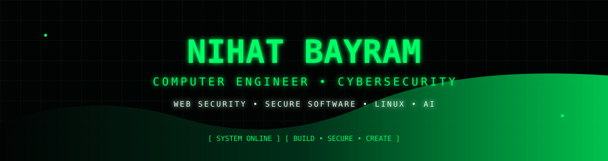
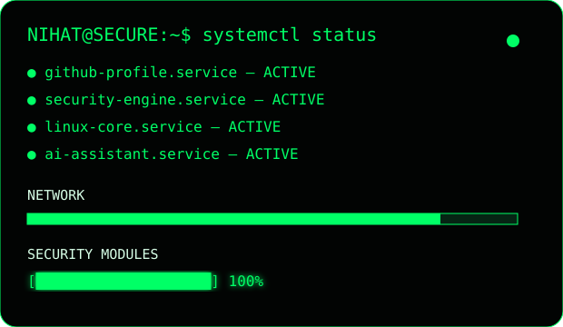
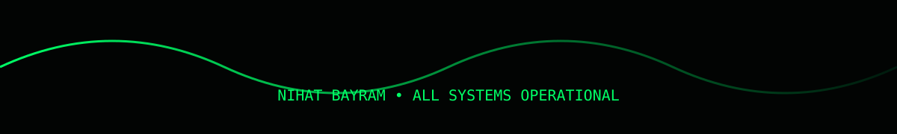

<p align="center">
  
</p>

<p align="center">
  <a href="https://github.com/nihatbayramm"></a>
  <a href="https://www.linkedin.com/in/nihat-bayram-b3a1b4277/"></a>
  <a href="https://www.instagram.com/1nihatbayram/"></a>
</p>

<h2 align="center">⌁ TERMINAL ACCESS GRANTED ⌁</h2>

<p align="center">
  
</p>

> **Computer Engineer** focused on **Cybersecurity, Web Security, Secure Software, Linux and AI-assisted development.**

---

## 🛡️ PROFILE

<table>
<tr>
<td width="55%">

```text
┌──────────────────────────────────┐
│ NIHAT BAYRAM / SYSTEM PROFILE    │
├──────────────────────────────────┤
│ ROLE      : COMPUTER ENGINEER    │
│ SECURITY  : WEB / APPSEC         │
│ SYSTEM    : LINUX                │
│ CODE      : PYTHON / C / JAVA    │
│ WEB       : JS / HTML / CSS      │
│ BACKEND   : .NET / NODE / SQL    │
│ MODE      : BUILD • LEARN • SECURE│
│ STATUS    : ● ONLINE             │
└──────────────────────────────────┘
```

</td>
<td width="45%" align="center">



</td>
</tr>
</table>

---

## ⚡ TECHNOLOGY MATRIX

<p align="center">

</p>

<p align="center">


</p>

---

## 📊 GITHUB TELEMETRY

<p align="center">


</p>

---

## 🚀 SELECTED PROJECTS

| Project | Focus |
|---|---|
| [**ShadowScanV2.0**](https://github.com/nihatbayramm/shadowScanV2.0) | Security / scanning |
| [**FFT-Based-Network-Anomaly-Detection-System**](https://github.com/nihatbayramm/FFT-Based-Network-Anomaly-Detection-System) | Network anomaly detection |
| [**Linux-System-Monitor**](https://github.com/nihatbayramm/Linux-System-Monitor) | Linux / system monitoring |
| [**YoloMaskeTespitModeli**](https://github.com/nihatbayramm/YoloMaskeTespitModeli) | Computer vision / AI |
| [**BilisimTeknolojileri**](https://github.com/nihatbayramm/BilisimTeknolojileri) | Education / web content |
| [**personal-website**](https://github.com/nihatbayramm/personal-website) | Web development |

---

## 🎓 EDUCATION

<p align="center">

**IĞDIR UNIVERSITY**  
Computer Engineering • **2022 — 2026**

**ŞIRNAK MUSTAFA BAYRAM ÇPAL**  
Information Technologies / Web Design

</p>

---

## 🐍 CONTRIBUTION MATRIX

<p align="center">

</p>

---

## 🎯 CURRENT MISSION

```text
CYBERSECURITY          ████████████████████  ONLINE
WEB SECURITY           ███████████████████░  ACTIVE
SECURE DEVELOPMENT     ██████████████████░░  ACTIVE
ARTIFICIAL INTELLIGENCE█████████████████░░░  ACTIVE
LINUX                  ████████████████████  ONLINE
```

---

<p align="center">
  
</p>

<p align="center"><b>SECURITY IS NOT A PRODUCT. IT IS A PROCESS.</b></p>
<p align="center"><sub>© 2026 Nihat Bayram</sub></p>
